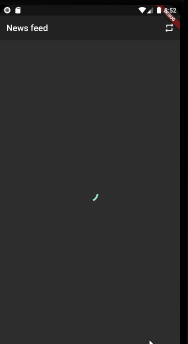
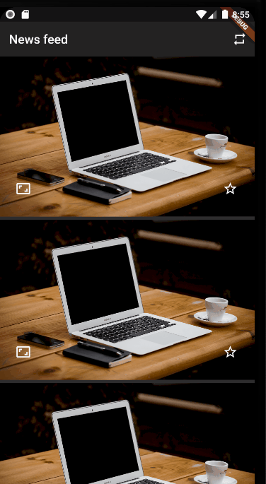

# Flutter news feed application

Flutter news feed application

## Dependencies

* flutter_bloc: ^0.19.1 
* http: ^0.12.0+2 
* equatable: ^0.3.0 

## Screenshots And Usage

### Loading news

### Scroll loading

### Full screen

## Getting Started

This project is a starting point for a Flutter application.

A few resources to get you started if this is your first Flutter project:

- [Lab: Write your first Flutter app](https://flutter.dev/docs/get-started/codelab)
- [Cookbook: Useful Flutter samples](https://flutter.dev/docs/cookbook)

For help getting started with Flutter, view our
[online documentation](https://flutter.dev/docs), which offers tutorials,
samples, guidance on mobile development, and a full API reference.

## Bonus

